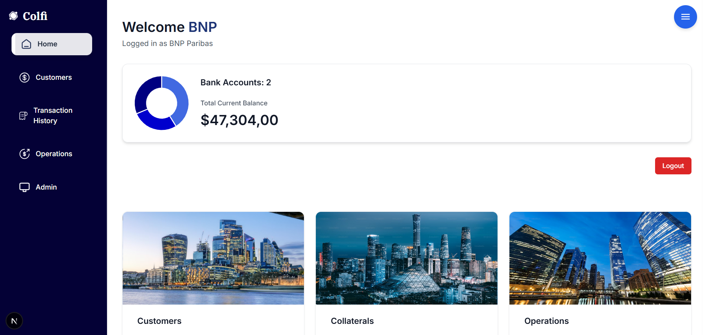

# ColFi - Collateral Finance Management DApp

A decentralized web application for managing financial assets, including collaterals and bonds for financial institutions.

## Overview

This Web App is a Next.js-based decentralized application (DApp) that provides financial institutions with a comprehensive platform to manage their assets, particularly focusing on collateral management and bond tracking. The application streamlines asset management processes through an intuitive web interface.
## Preview

*Main dashboard interface for asset and collateral management*
## Features

- **Asset Management**: Track and manage various financial assets
- **Collateral Tracking**: Monitor collateral positions and valuations
- **Bond Management**: Comprehensive bond portfolio management
- **Real-time Data**: Live updates on asset values and market conditions
- **Secure Platform**: Built with security-first principles for financial data
- **Responsive Design**: Optimized for desktop and mobile use

## Technology Stack

- **Frontend**: Next.js, React
- **Styling**: Tailwind CSS
- **Deployment**: AWS Amplify, AWS EC2, Docker, Hyper Ledger Fabric.
- **Version Control**: Git/GitHub

## Getting Started

### Prerequisites

- Node.js (v14 or higher)
- npm 
- Git

### Installation

1. Clone the repository:
```bash
git clone https://github.com/Adamkhald/colfi-internship-dapp.git
```

2. Navigate to the project directory:
```bash
cd colfi-internship-dapp
```

3. Install dependencies:
```bash
npm install
```

4. Run the development server:
```bash
npm run dev
```

5. Open [http://localhost:3000](http://localhost:3000) in your browser

## Available Scripts

- `npm run dev` - Starts the development server
- `npm run build` - Creates an optimized production build
- `npm run start` - Starts the production server
- `npm run lint` - Runs ESLint for code quality checks

## Project Structure

```
colfi-internship-dapp/
├── components/          # Reusable UI components
├── pages/              # Next.js pages and API routes
├── public/             # Static assets
├── styles/             # CSS and styling files
├── utils/              # Utility functions
└── README.md
```

## Deployment

This application is configured for deployment on AWS Amplify with automatic deployments from the main branch.

## Contributing

1. Fork the repository
2. Create a feature branch (`git checkout -b feature/new-feature`)
3. Commit your changes (`git commit -m 'Add new feature'`)
4. Push to the branch (`git push origin feature/new-feature`)
5. Open a Pull Request

## License

This project is part of an internship program .

## Contact

For questions or support, please contact the development team.

---

